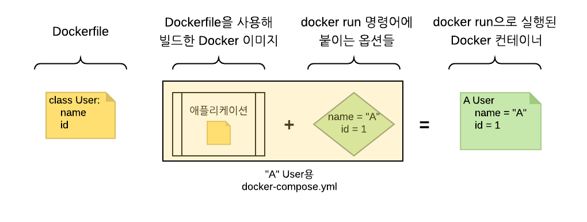

# Docker 실습

[도커 개념](./README.md)  
[1.Docker file](#1.docker-file)  
[2.DockerFile 기본 명령어](#2.dockerfile-기본-명령어)  
[3.도커 기본 명령어](#3.도커-기본-명령어)  
[4.Docker Compose](#4.docker-compose)  
[5.Docker compose 문법](#5.docker-compose-문법)  
[6.network](#6.network)

<p align="center">  </img> </p>

## 1.docker file

```dockerfile
FROM python:3.8.5-alpine
ENV PYTHONUNBUFFERED 1

RUN mkdir /code
WORKDIR /code

RUN mkdir src
RUN python3 -m venv venv
 
COPY requirements.txt /code/
RUN pip install -r requirements.txt

COPY src/ /code/src/
```

- 도커 이미지를 만들기 위해 DockerFile에 자체언어를 이용해 작성한다.

- 서버에 환경을 구축하기 위해서 이거저것 패키지를 설치하면서 한번씩 엎어본 경험이 있다면 Docker 파일로 환경 구성을 하는게 간단하다는것을 알수있다.

## 2.DockerFile 기본 명령어

- 1.FROM  
    - 베이스 이미지(OS) 지정. 
    - 이미 만들어진 다양한 베이스 이미지는 Docker hub에서 확인가능. 


- 2.MAINTAINER   

    - Dockerfile을 관리하는 사람의 이름 또는 이메일 정보 작성. 
    - 빌드에 딱히 영향이 없음.

- 3.COPY    
  
    - 파일이나 디렉토리를 이미지를 복하며 일반적으로 소스를 복사하는 데 사용.​ 
    - target디렉토리가 없다면 자동으로 생성한다

- 4.ADD  
​   
    - COPY명령어와 매우 유사하나 몇가지 추가 기능이 있습니다. 
    
    - src에 파일 대신 URL을 입력할 수 있고​ src에 압축 파일을 입력하는 경우 자동으로 압축을 해제하면서 복가능

- 5.RUN  
​   
    - 가장 많이 사용능는 구문으로 명령어를 그대로 실행한다
    
    - 내부적으로 /bin/sh -c 뒤에 명령어를​ 실행하는 방식

- 6.CMD
​   
    - 도커 컨테이너가 실행되었을 때 실행되는 명령어를 정의.

    - 빌드할 때는 실행되지 않으며 여러 개의 CMD가​ 존재할 경우 가장 마지막 CMD만 실행

    - 한꺼번에 여러 개의 프로그램을 실행하고 싶은 경우에는 run.sh​ 파일을 작성하여 데몬으로 실행

- 7.WORKDIR
​   
    - RUN, CMD, ADD, COPY등이 이루어질 기본 디렉토리를 설정

    - 각 명령어의 현재 디렉토리는 한 줄마다​ 초기화되기 때문에 RUN cd /path를 하더라도 다음 명령어에선 위치가 초기화

    - 같은 디렉토리에서​ 계속 작업하기 위해서 WORKDIR을 사용합니다

- 8.EXPOSE
​   
    - 도커 컨테이너가 실행되었을 때 요청을 기다리고 있는(Listen) 포트를 지정합니다. 

    - 여러개의 포트를 지정할 수​ 있습니다.

- 9.VOLUME
​   
    - 컨테이너 외부에 파일시스템을 마운트 할 때 사용

    - 반드시 지정하지 않아도 마운트 할 수 있지만,​ 기본적으로 지정하는 것이 좋음

- 10.ENV
​   
    - 컨테이너에서 사용할 환경변수를 지정

    - 컨테이너를 실행할 때 -e옵션을 사용하면 기존 값을 오버라이딩​

## 3.도커 기본 명령어

> Dockerfile을 만들어 봤으니 Docker를 실행 시켜 사용해 봐야한다. 
> 그전에 간단한 기본 명령어에 대해 알아야한다 

|옵션|설명|
|---|---|
|-d|백그라운드 모드|
|-p|호스트와 컨에티너의 포트 연결|
|-v|호스트와 컨테이너의 디렉토리 연결|
|-e|컨테이너 내에서 사용할 환경변수 설정|
|-name|컨테이너 이름 설정|
|-rm|프로세스 종료시 컨테이너 자동 제거|
|-it|-i와 -t를 동시에 사용한 것으로 터미널 입력 위한 옵션|
|link|컨테이너 연결|

- 도커 파일을 이미지화 시키기 

```Docker
docker build [OPTIONS] PATH | URL | -
```
> 예시 : Docker 파일 이름을 app이라고 가정
> Docker build --tag appImage ./app 


- 이미지를 컨테이너로 실행시키기 

```Docker
docker run [OPTIONS] IMAGE[:TAG|@DIGEST] [COMMAND] [ARG...]
```
> 예시 : image의 이름을 app라고 가정
> docker run --name app -d -p 80:80 -v ./django:/data hello:0.1
> 컨테이너를 백그라운드에서 실행 시키면서, 포트는 80포트로, 볼륨 설정으로 현재 django의 내용을 도커에 연결

- 컨테이너 목록 확인하기 
```Docker
docker ps [OPTIONS]
```

- 컨테이너 중지하기
```Docker
docker stop [OPTIONS] CONTAINER [CONTAINER...]
```

- 컨테이너 제거하기
```Docker
docker rm [OPTIONS] CONTAINER [CONTAINER...]
```

- 이미지 목록 가져오기 
```Docker
docker images [OPTIONS] [REPOSITORY[:TAG]]
```

- Docker hub에 있는 이미지 내려받기
```Docker
docker pull [OPTIONS] NAME[:TAG|@DIGEST]
```

- 이미지 삭제하기
```Docker
docker rmi [OPTIONS] IMAGE [IMAGE...]
```

- 컨테이너 로그 보기
```Docker
docker logs [OPTIONS] CONTAINER
```

- 컨테이너 명령어 실행하기 
```Docker
docker exec [OPTIONS] CONTAINER COMMAND [ARG...]
```

## 4.Docker Compose

- 도커는 복잡한 설정을 쉽게 하기 위해 YAML 방식의 설정파일 Docker Compose라는 툴이 있다.

- Docker Compose에서 컨테이너 들간의 옵션과 의존성을 모두 docker-compose.yml 파일에 적어두고, 컴포즈용 명령어를 사용해 컨테이덜을 실행, 관리 

<p align="center">  </img> </p>

> express , nginx , mysql , redis를 연결한 모양 
```yaml
version: '3'

services:
  nginx:
    build:
      context: ./nginx
    container_name: nginx
    entrypoint: dockerize -wait tcp://node:3000 -timeout 5m
    command: [ 'nginx', '-g', 'daemon off;' ]
    networks:
      - node_nginx
    depends_on:
      - node
    ports:
      - 80:80
    restart: "unless-stopped"
  node:
    build:
      context: ./node
    container_name: node
    volumes:
      - ./node/:/usr/src/app/
      - /usr/src/app/node_modules/
    entrypoint: dockerize -wait tcp://mysql:3306 -timeout 5m
    command: tail -f /dev/null
    # command:  ["pm2-runtime", "app.js","--watch"]
    networks:
      - node_nginx
      - node_mysql
      - node_redis
    depends_on:
      - mysql
      - redis
    restart: "unless-stopped"
  mysql:
    image: mysql:5.7
    command: --innodb-use-native-aio=0
    container_name: mysql
    restart: always
    volumes:
      - ./mysql:/var/lib/mysql
    environment:
      - MYSQL_DATABASE=nodedb
      - MYSQL_ROOT_PASSWORD=root
      
    ports:
      - 3306:3306
    networks:
      - node_mysql
  redis:
    image: redis:alpine
    container_name: redis
    ports:
      - 3307:3307
    networks: 
      - node_redis
networks:
  node_nginx:
    driver: bridge
  node_mysql:
    driver: bridge
  node_redis:
    driver: bridge
```

## 5.Docker compose 문법

- 1.version
    - ​ docker-compose.yml 파일의 제일 윗부분에는 파일 규격 버전

- 2.services
    - ​ 실행하려는 서비스(앱 컨테이너나 DB컨테이너의 묶음)을 정의 

- 3.image
    - ​ 서비스에서 사용할 도커 이미지

- 4.volumes
    - ​ docker run으로 앱 컨테이너를 실행할 때 –volume 옵션을 사용하여 데이터베이스의 데이터를 로컬 컴퓨터에​ 저장했던 부분과 동일
    -  docker-compose.yml에서는 상대 경로를 지정 가능

- 5.environment
    - ​ docker run에서 -e 옵션에 적었던 내용.

- 6.build
    - ​ 앱 서비스는 도커 이미지를 빌드할 일이 잦기 때문에, 특정 이미지 대신 build 옵션을 추가

- 7.port
    - ​ 도커 컴포즈로 서비스를 실행하면 기본적으로 가상의 네트워크가 하나 만들어지고, 네트워크 외부의 접근이​ 제한 
    - 따라서 외부에서 접근할 수 있는 포트를 지정

- 8.depends_on
    - ​ 서비스가 하나 이상일 때, 실행 의존성을 지정

- 9.links
    - ​ docker run에서 –link 옵션이랑 동일

- 10.command
    - docker run으로 앱 컨테이너를 실행하는 command 


## 6.network

> Docker compose에서 다룬 network를 따로 빼서 설명한다.

- 기본적으로 Docker Compose는 하나의 디폴트 네트워크에 모든 컨테이너를 연결
- 디폴트 네트워크의 이름은 docker-compose.yml가 위치한 디렉토리 이름 뒤에 _default로 지정. 
> 예시: 디렉토리가 app라면 디폴트 네트워크 이름은 app_default

- 컨테이너 간의 통신을 하기 위해 디폴트가 아닌 커스텀으로 만들고자 할때 network를 사용해야한다

```yaml
services:
  django:
    build: .
    ports:
      - "8000:8000"
    networks:
      - default
      - dajngo_db

  db:
    image: postgres
    environment:
      - POSTGRES_USER=postgres
      - POSTGRES_PASSWORD=postgres

networks:
  django_db:
    driver: bridge

```
- 위 예시를 보면 django에 디폴트 네트워크 뿐만 아니라 django_db를 연결할수 있다.
