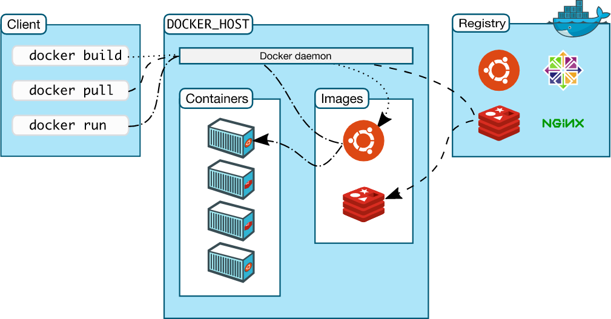

# DockerStudy

[도커 실습](./Dockeruse.md)  
[1.Docker란 무엇일까?](#1.docker란-무엇일까?)  
[2.가상머신 vs 도커](#2.가상머신-vs-도커)  
[3.도커의 장점](#3.도커의-장점)  
[4.도커의 아키텍쳐](#4.도커의-아키텍쳐)  
[5.도커의 이미지](#5.도커의-이미지)  

## 1.Docker란 무엇일까?

  </img> 

- 문서: 예전에는 서버를 운영하기 위해 문서에 운영방법을 적고 사용했었지만, 시간이 지나면서 문서의 정확성, 서버의 업데이트에 관련된 이력드를 관리하기가 힘들어지기 시작

- 상태관리 : 상태관리 도구는 프로그램을 실행할 때 프로그램이 참조하는 설정파일을 코드로 작성하여 협업도 하고 버전관리도 할 수 있어 편리해졌다. 하지만 러닝커브가 높고 서버에서 다른 버전을 여러개 설치하는건 힘듬

- 가상머신 : 한 서버에 여러개 설치가 쉽고, 현재 상태를 스냅샷으로 저장할 수도 있었지만, 처음부터 셋팅하는 방법이나 이미지 공유를 하기 힘들었으면, 속도 측면에서 좋지 않았다

- 자원격리 : 리눅스 가상화 기술을 사용해 프로세스, 파일, 디렉토리를 가상으로 분리하여 속도도 빠르고 효율적인 서버 관리를 할수있었지만 러닝커브가 너무 높어 IT 대기업에서 사용하였다.

- 이러한 단점들로 인해 쉽고 간편하게 관리할수 있는 방법이 없을까 고민하던 찰나에 2013년 Docker가 등장 했다. 

- 도커(Docker)는 컨테이너라는 격리된 환경에서 작동하는 프로세스를 오픈소스로 공개하였고 리눅스 커널의 여러 기술을 활용해 가성머신을 돌렸을때보다 훨씬 효율이 좋았다.
## 2.가상머신 vs 도커

  </img> 

- 위 그림은 가상머신과 도커의 차이를 나타내는 것이다.

- 가상머신은 하이퍼 바이저를 통해 Guest OS를 만들어내고 그 위에 프로젝트를 올린다.

    - 이렇게 하였을 경우 Guest OS는 Host OS의 자원을 일부 사용하여 Host OS, Guest OS에도 비효율적이며, 확장성 역시 떨어지게 된다.

- 도커의 컨테이너의 경우는 하나의 Host OS에 마치 각각의 독립적인 프로그램처럼 관리되고 실행된다. 불필요한 OS만드는 작업 및 infra를 독립적으로 나눌 필요가 없어 확장서잉 좋다.

## 3.도커의 장점

- 실행 환경을 쉽고 빠르게 구축

    - 개발 프로젝트는 보통 여러명에서 협업을 통해 진행하게된다.

    - 따라서 개발환경 세팅의 경우 사람마다 달라질 가능성이 있는지만 Docker를 통해 고정할수있다.

- 빠른 실행 속도

    - 가상 머신과는 다르게 컨테이너를 통해 메모리와 용량을 절약할수 있다.

- 하드웨어 자원 절감

    - 컨테이너의 크기는 매우 작고, 하나의 물리 서버에 여러 컨테이너를 가동 시킬수 있다.

- 공유 환경 제공

    - Docker Hub(git과 github의 관계)와 같이 Docker에 대한 결과물을 공유할수있다.

- 쉬운 배포

    - 프로그램이 개발이 완료되면 개발했던 환경을 그대로 배포할수 있다.

> 그러나 Docker자체가 Linux기반의 환경을 기반하기 때문에 Linux에 대해 어느정도 이해가 있어야 사용이 가능하다 

## 4.도커의 아키텍쳐

  </img> 

> Docker는 Client - Sever 아키텍쳐로 Docker 클라이언트와 도커 데몬이 REST 통신을 통해 통신

- Docker daemon

    -  Docker Api 요청수신, 이미지,컨테이너,네트워크와 같은 도커 객체 및 도커 서비스 관리

- Docker client

    - Docker 사용자가 Docker와 상호작용하기 위한 방법 기본적인 도커명령어를 통해서 Docker 데몬과 통신

- Docker Registy

    - Docker 이미지를 저장, Docker hub이라는 공용 레지스트리와 개인private한 레지스트리가 있다. 일반적으로 공용 레지스트리에서 실행

- Docker 객체
    
    - Docker image : 도커 이미지는 컨테이너 실행에 필요한 파일과 설정값등을 포함하며 상태값이 변하지 않기 때문에 의존성에 문제에 영향을 받지 않는다.
    
    - Container : Docker image를 통해 실행 가능한 인스턴스
    > 쉽게 생각하면 Docker image는 윈도우 설치 usb, 컨테이너는 컴퓨터 같은 느낌

## 5.도커의 이미지

- 도커 이미지는 실행에 필요한 파일과 설정값등을 포함하고 있다.

- 그리고 컨테이너에 따른 상태값이 변하지 않으므로 라이브러리의 버전이 의도치 않게 바뀜에 따른 의존성 문제가 발생하지 않는다.

- 컨테이너는 이미지를 실행한 상태이며, 변하는 값은 컨테이너에 저장된다.(이미지는 변하지 않는다).

- 같은 이미지에서 여러개의 컨테이너를 생성할 수 있다.
